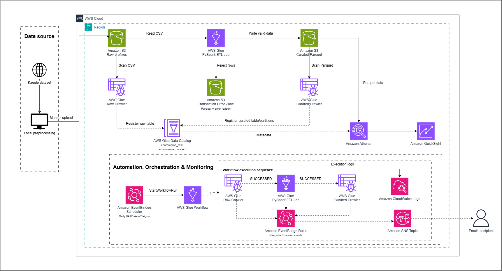

# Serverless E-commerce Analytics Data Lake on AWS

A serverless batch data pipeline that transforms synthetic e-commerce CSV data into validated, curated Parquet datasets for Amazon Athena and Amazon QuickSight.

This project was developed as an AWS internship workshop project and focuses on data lake storage, ETL processing, metadata management, workflow orchestration, and downstream analytics.

## Architecture



The architecture follows a serverless batch workflow:

- Raw CSV files are uploaded to the Amazon S3 Raw Zone.
- AWS Glue Crawlers register raw and curated metadata in the Glue Data Catalog.
- A Glue PySpark ETL job transforms and validates the source data.
- Valid records are written as Parquet to the Curated Zone, while rejected transactions are preserved in the Error Zone.
- Amazon Athena queries curated datasets and serves reusable SQL views to Amazon QuickSight.
- AWS Glue Workflow and EventBridge Scheduler automate the processing sequence.
- CloudWatch, EventBridge Rules, and Amazon SNS provide execution visibility and failure notifications.

## Data

| Source | Rows |
|---|---:|
| Events | 2,000,000 |
| Products | 2,000 |
| Transactions | 103,127 |

Dataset:  
https://www.kaggle.com/datasets/geethasagarbonthu/marketing-and-e-commerce-analytics-dataset

## S3 Layout

```text
s3://<bucket>/
├── raw/
│   ├── events/
│   ├── products/
│   └── transactions/
├── curated/
│   ├── fact_events/
│   ├── dim_products/
│   └── fact_transactions/
├── error/
│   └── transactions/
└── athena-results/
```

## ETL Outputs

- `fact_events` — Parquet, partitioned by `year/month/day`
- `dim_products` — Parquet
- `fact_transactions` — Parquet, partitioned by `year/month/day`
- invalid transaction records — written to `error/transactions/` with `error_reason`

The ETL job uses PySpark to standardize schemas, clean values, derive date fields, validate transactions, and write curated outputs.

## Data Quality

Transaction validation includes:

```text
INVALID_TRANSACTION_TIMESTAMP
MISSING_PRODUCT_ID
MISSING_GROSS_REVENUE
NEGATIVE_REVENUE_WITHOUT_REFUND_FLAG
```

Verified curated transaction output:

- 92,678 transaction rows
- 0 checked nulls in transaction ID, timestamp, product ID, and revenue
- 0 rows with negative revenue and `is_refunded = false`

## Orchestration & Monitoring

AWS Glue Workflow coordinates the execution order of the Raw Crawler, PySpark ETL job, and Curated Crawler. Amazon EventBridge Scheduler starts the workflow on schedule.

Operational components:

- AWS Glue Workflow
- Amazon EventBridge Scheduler
- CloudWatch Logs
- EventBridge failure rules
- Amazon SNS email alerts

## Serving Layer

Amazon Athena queries the curated Parquet datasets and exposes reusable SQL views for QuickSight Direct Query.

Project outputs include:

- 9 Athena views
- 5 QuickSight dashboard exports

## Tech Stack

`AWS S3` · `AWS Glue` · `PySpark` · `Glue Data Catalog` · `Athena` · `EventBridge` · `CloudWatch` · `SNS` · `QuickSight` · `SQL`

## Full Case Study

For the full architecture explanation, engineering decisions, validation details, limitations, and project results:

**Portfolio:**  
https://haiha-de-portfolio.vercel.app/projects/aws-data-lake/
- LinkedIn: https://www.linkedin.com/in/hai-ha-nguyen-thi-1b1510378/

